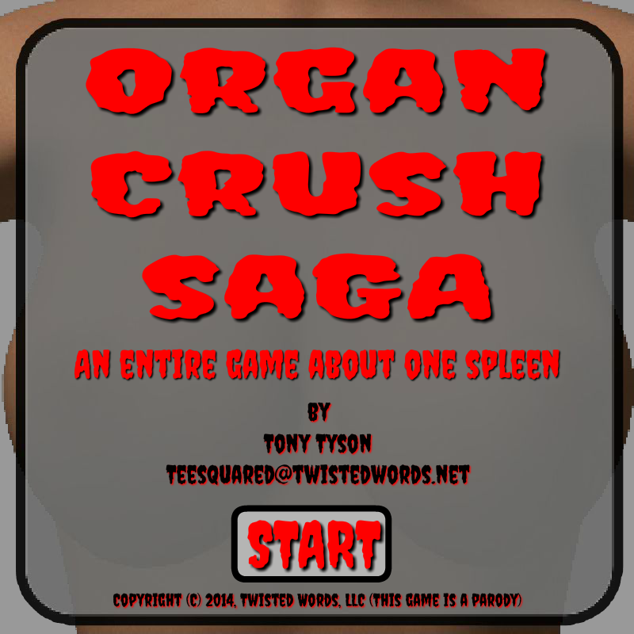

Organ Crush Saga
================

_An entire game about one spleen..._
------------------------------------

This game was written in 48 hours for LD31. The theme was "Entire Game on One Screen."

A match is three or more organs in a column or row.
Start by moving any organs around. They don't have to create a match.
After a few turns, the stomach will appear and then the spleen.
Once both appear, you will have a limited number of turns to move the spleen adjacent to the stomach.
The stomach cannoted by move directly.
The spleen can only move if it makes a match.
Good luck!

[Organ Crush Saga Entry](http://ludumdare.com/compo/ludum-dare-31/?action=preview&uid=35091)

[Organ Crush Saga Game](http://www.twistedwords.net/ld31/OrganCrushSaga.swf)
